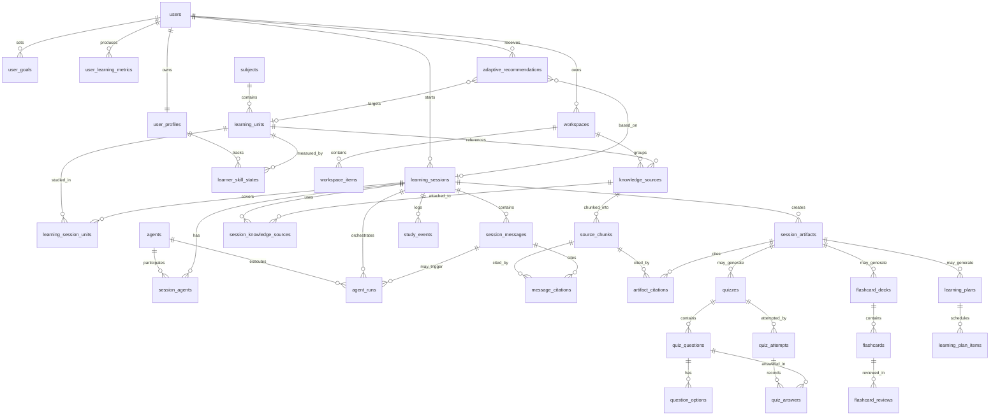

# ERD đề xuất cho Multi-agent Adaptive Learning App

Tài liệu này suy ra từ các màn hình hiện có: Home, AI Agent, Solo/Team Session, Chat, Sources, Artifacts, Insights, Workspace và Profile. Schema được thiết kế để chạy được MVP hiện tại, đồng thời mở đường cho adaptive learning, multi-agent orchestration, quiz, flashcard, planner và phân tích học tập về sau.

## Mermaid ERD



## Bảng cốt lõi theo UI hiện tại

### 1. Identity và profile

#### `users`
Lưu tài khoản đăng nhập.

| Field | Type | Ghi chú |
|---|---|---|
| `id` | uuid, pk | User id |
| `email` | varchar, unique | Email đăng nhập |
| `display_name` | varchar | Tên hiển thị |
| `avatar_url` | text | Avatar trên AppBar/Profile |
| `role` | enum(`learner`,`mentor`,`admin`) | Mở rộng sau |
| `created_at` | timestamptz |  |
| `updated_at` | timestamptz |  |

#### `user_profiles`
Khớp với `ProfileModel`: title, education, level.

| Field | Type | Ghi chú |
|---|---|---|
| `user_id` | uuid, pk, fk -> users.id | 1-1 với user |
| `title` | varchar | Ví dụ Senior Cognitive Researcher |
| `birth_year` | int |  |
| `education` | varchar |  |
| `level` | int | Gamification/current learner level |
| `learning_style` | enum(`visual`,`reading`,`practice`,`mixed`) | Gợi ý cho adaptive |
| `daily_goal_minutes` | int | Dùng cho Daily Focus |
| `timezone` | varchar | Lịch học và insight theo giờ địa phương |
| `metadata` | jsonb | Trường linh hoạt |

#### `user_goals`
Dữ liệu cho “You have 2 goals for today” và planner.

| Field | Type | Ghi chú |
|---|---|---|
| `id` | uuid, pk |  |
| `user_id` | uuid, fk |  |
| `title` | varchar |  |
| `goal_type` | enum(`daily`,`weekly`,`course`,`skill`) |  |
| `target_value` | numeric | Ví dụ 45 phút, 20 flashcards |
| `current_value` | numeric | Tiến độ |
| `unit` | varchar | `minutes`, `cards`, `docs`, `%` |
| `due_date` | date |  |
| `status` | enum(`active`,`completed`,`paused`,`missed`) |  |
| `created_at` | timestamptz |  |

### 2. Workspace và học liệu

#### `workspaces`
Khớp màn Workspace: AI Research, Flutter, Machine Learning, Study Notes.

| Field | Type | Ghi chú |
|---|---|---|
| `id` | uuid, pk |  |
| `user_id` | uuid, fk -> users.id | Chủ workspace |
| `name` | varchar |  |
| `description` | text |  |
| `icon_key` | varchar | Key icon Flutter/UI |
| `color_hex` | char(7) | Màu card |
| `sort_order` | int |  |
| `created_at` | timestamptz |  |
| `updated_at` | timestamptz |  |

#### `workspace_items`
File/report/resource trong workspace.

| Field | Type | Ghi chú |
|---|---|---|
| `id` | uuid, pk |  |
| `workspace_id` | uuid, fk |  |
| `knowledge_source_id` | uuid, fk nullable | Nếu item là source học tập |
| `name` | varchar |  |
| `item_type` | enum(`file`,`folder`,`report`,`note`,`link`) |  |
| `storage_uri` | text | S3/Firebase/local path |
| `mime_type` | varchar |  |
| `size_bytes` | bigint | Dùng cho StorageCard |
| `created_at` | timestamptz |  |
| `updated_at` | timestamptz |  |

#### `subjects`
Nhóm môn/chủ đề, ví dụ Quantum Mechanics, Neural Networks.

| Field | Type | Ghi chú |
|---|---|---|
| `id` | uuid, pk |  |
| `name` | varchar |  |
| `description` | text |  |
| `parent_subject_id` | uuid, fk nullable -> subjects.id | Cho cây kiến thức |

#### `learning_units`
Đơn vị kiến thức nhỏ hơn, dùng cho adaptive tracking.

| Field | Type | Ghi chú |
|---|---|---|
| `id` | uuid, pk |  |
| `subject_id` | uuid, fk |  |
| `title` | varchar | Ví dụ Chapter 4: Wave Function Collapse |
| `unit_type` | enum(`chapter`,`section`,`concept`,`skill`) |  |
| `difficulty` | int | 1-5 |
| `estimated_minutes` | int |  |
| `prerequisite_unit_ids` | uuid[] hoặc bảng nối | Có thể tách bảng nếu cần query sâu |

#### `knowledge_sources`
Khớp Sources/Knowledge Base: pdf, website, book, video.

| Field | Type | Ghi chú |
|---|---|---|
| `id` | uuid, pk |  |
| `workspace_id` | uuid, fk nullable | Source thuộc workspace nào |
| `learning_unit_id` | uuid, fk nullable | Source hỗ trợ concept/chapter nào |
| `title` | varchar |  |
| `source_type` | enum(`pdf`,`website`,`video`,`book`,`note`,`upload`) | Theo `KnowledgeType` + mở rộng |
| `source_url` | text | URL/file URI |
| `author` | varchar |  |
| `published_at` | date |  |
| `ingestion_status` | enum(`pending`,`processing`,`ready`,`failed`) | Cho PDF analyzer/RAG |
| `metadata` | jsonb | Page count, duration, ISBN... |
| `created_at` | timestamptz |  |

#### `source_chunks`
Phục vụ RAG/citation cho agent.

| Field | Type | Ghi chú |
|---|---|---|
| `id` | uuid, pk |  |
| `knowledge_source_id` | uuid, fk |  |
| `chunk_index` | int |  |
| `content` | text | Text chunk |
| `embedding_vector_id` | varchar | Id trong vector DB |
| `page_start` | int nullable | PDF/book |
| `page_end` | int nullable | PDF/book |
| `timestamp_start_sec` | int nullable | Video |
| `timestamp_end_sec` | int nullable | Video |
| `token_count` | int |  |

### 3. Agent và session

#### `agents`
Khớp màn “Select Your Agent”.

| Field | Type | Ghi chú |
|---|---|---|
| `id` | uuid, pk |  |
| `name` | varchar | Researcher, Summarizer... |
| `role` | varchar |  |
| `description` | text |  |
| `avatar_url` | text |  |
| `icon_key` | varchar |  |
| `capabilities` | text[] | `research`, `summarize`, `quiz`, `planner` |
| `system_prompt` | text | Prompt cấu hình |
| `model_provider` | varchar | OpenAI/local/etc. |
| `model_name` | varchar |  |
| `is_active` | boolean |  |
| `created_at` | timestamptz |  |

#### `learning_sessions`
Trục chính cho Solo Session, Team Session và Resume Session.

| Field | Type | Ghi chú |
|---|---|---|
| `id` | uuid, pk |  |
| `user_id` | uuid, fk -> users.id |  |
| `workspace_id` | uuid, fk nullable | Session trong workspace |
| `title` | varchar | Ví dụ Advanced Quantum Mechanics |
| `session_mode` | enum(`solo`,`team`) | Khớp Solo/Team |
| `status` | enum(`active`,`paused`,`completed`,`archived`) | Continue Learning dùng active/paused |
| `current_learning_unit_id` | uuid, fk nullable | Đang ở section/chapter nào |
| `progress_percent` | numeric(5,2) | Daily/Continue progress |
| `started_at` | timestamptz |  |
| `last_active_at` | timestamptz | Resume session |
| `ended_at` | timestamptz nullable |  |
| `metadata` | jsonb | UI state, tab cuối, settings |

#### `learning_session_units`
Session có thể học nhiều unit.

| Field | Type | Ghi chú |
|---|---|---|
| `session_id` | uuid, fk |  |
| `learning_unit_id` | uuid, fk |  |
| `coverage_percent` | numeric(5,2) | Đã phủ bao nhiêu |
| `mastery_delta` | numeric(5,2) | Tăng/giảm mastery sau session |
| `primary key` | (`session_id`, `learning_unit_id`) |  |

#### `session_agents`
Agent tham gia session.

| Field | Type | Ghi chú |
|---|---|---|
| `id` | uuid, pk |  |
| `session_id` | uuid, fk |  |
| `agent_id` | uuid, fk |  |
| `agent_order` | int | Thứ tự trong team/carosel |
| `state` | enum(`idle`,`thinking`,`typing`,`done`,`error`) | Dùng TypingIndicator |
| `joined_at` | timestamptz |  |
| `left_at` | timestamptz nullable |  |

#### `session_messages`
Khớp Chat panel và MessageBubble.

| Field | Type | Ghi chú |
|---|---|---|
| `id` | uuid, pk |  |
| `session_id` | uuid, fk |  |
| `sender_type` | enum(`user`,`agent`,`system`) |  |
| `sender_user_id` | uuid, fk nullable | Khi user gửi |
| `sender_agent_id` | uuid, fk nullable | Khi agent gửi |
| `content` | text | Nội dung chat |
| `message_type` | enum(`text`,`markdown`,`artifact_ref`,`source_ref`) |  |
| `parent_message_id` | uuid, fk nullable -> session_messages.id | Thread/reply |
| `created_at` | timestamptz |  |
| `metadata` | jsonb | Token usage, confidence... |

#### `session_knowledge_sources`
Source được gắn vào session.

| Field | Type | Ghi chú |
|---|---|---|
| `session_id` | uuid, fk |  |
| `knowledge_source_id` | uuid, fk |  |
| `added_by_user_id` | uuid, fk nullable |  |
| `added_by_agent_id` | uuid, fk nullable | Agent tự tìm source |
| `relevance_score` | numeric(5,4) | RAG ranking |
| `created_at` | timestamptz |  |
| `primary key` | (`session_id`, `knowledge_source_id`) |  |

#### `message_citations`
Agent trả lời có trích nguồn nào.

| Field | Type | Ghi chú |
|---|---|---|
| `message_id` | uuid, fk |  |
| `source_chunk_id` | uuid, fk |  |
| `quote` | text nullable | Trích đoạn ngắn |
| `confidence` | numeric(5,4) |  |
| `primary key` | (`message_id`, `source_chunk_id`) |  |

#### `agent_runs`
Log từng lượt agent xử lý, quan trọng cho multi-agent debugging.

| Field | Type | Ghi chú |
|---|---|---|
| `id` | uuid, pk |  |
| `session_id` | uuid, fk |  |
| `agent_id` | uuid, fk |  |
| `trigger_message_id` | uuid, fk nullable | User/agent message kích hoạt |
| `run_type` | enum(`research`,`summarize`,`critique`,`quiz_generation`,`plan_generation`,`retrieval`) |  |
| `input_payload` | jsonb |  |
| `output_payload` | jsonb |  |
| `status` | enum(`queued`,`running`,`succeeded`,`failed`,`cancelled`) |  |
| `started_at` | timestamptz |  |
| `finished_at` | timestamptz nullable |  |
| `latency_ms` | int nullable |  |
| `token_input` | int nullable |  |
| `token_output` | int nullable |  |
| `cost_usd` | numeric(12,6) nullable |  |

### 4. Artifacts, quiz, flashcard, planner

#### `session_artifacts`
Khớp tab Artifacts: Summary, Roadmap, Quiz, Flashcards.

| Field | Type | Ghi chú |
|---|---|---|
| `id` | uuid, pk |  |
| `session_id` | uuid, fk |  |
| `created_by_agent_id` | uuid, fk nullable |  |
| `title` | varchar |  |
| `artifact_type` | enum(`summary`,`roadmap`,`quiz`,`flashcards`,`notes`,`report`) |  |
| `status` | enum(`generating`,`ready`,`failed`,`archived`) | Theo `ArtifactStatus` |
| `content_markdown` | text nullable | Summary/report |
| `content_json` | jsonb nullable | Structured output |
| `version` | int |  |
| `created_at` | timestamptz |  |
| `updated_at` | timestamptz |  |

#### `artifact_citations`
Artifact trích từ source nào.

| Field | Type | Ghi chú |
|---|---|---|
| `artifact_id` | uuid, fk |  |
| `source_chunk_id` | uuid, fk |  |
| `primary key` | (`artifact_id`, `source_chunk_id`) |  |

#### `quizzes`
Quiz được tạo từ artifact hoặc trực tiếp từ session.

| Field | Type | Ghi chú |
|---|---|---|
| `id` | uuid, pk |  |
| `session_artifact_id` | uuid, fk nullable |  |
| `learning_unit_id` | uuid, fk nullable |  |
| `title` | varchar |  |
| `difficulty` | int | 1-5 |
| `created_at` | timestamptz |  |

#### `quiz_questions`
| Field | Type | Ghi chú |
|---|---|---|
| `id` | uuid, pk |  |
| `quiz_id` | uuid, fk |  |
| `question_text` | text |  |
| `question_type` | enum(`single_choice`,`multi_choice`,`true_false`,`short_answer`) |  |
| `correct_answer_text` | text nullable | Cho short answer |
| `explanation` | text | Adaptive feedback |
| `difficulty` | int | 1-5 |
| `skill_tag` | varchar nullable | Gắn concept |

#### `question_options`
| Field | Type | Ghi chú |
|---|---|---|
| `id` | uuid, pk |  |
| `question_id` | uuid, fk |  |
| `option_text` | text |  |
| `is_correct` | boolean |  |
| `sort_order` | int |  |

#### `quiz_attempts`
| Field | Type | Ghi chú |
|---|---|---|
| `id` | uuid, pk |  |
| `quiz_id` | uuid, fk |  |
| `user_id` | uuid, fk |  |
| `score_percent` | numeric(5,2) | Dùng Accuracy metric |
| `started_at` | timestamptz |  |
| `submitted_at` | timestamptz nullable |  |
| `duration_sec` | int nullable |  |

#### `quiz_answers`
| Field | Type | Ghi chú |
|---|---|---|
| `id` | uuid, pk |  |
| `attempt_id` | uuid, fk |  |
| `question_id` | uuid, fk |  |
| `selected_option_id` | uuid, fk nullable |  |
| `answer_text` | text nullable |  |
| `is_correct` | boolean |  |
| `time_spent_sec` | int |  |

#### `flashcard_decks`
| Field | Type | Ghi chú |
|---|---|---|
| `id` | uuid, pk |  |
| `session_artifact_id` | uuid, fk nullable |  |
| `learning_unit_id` | uuid, fk nullable |  |
| `user_id` | uuid, fk |  |
| `title` | varchar |  |
| `created_at` | timestamptz |  |

#### `flashcards`
| Field | Type | Ghi chú |
|---|---|---|
| `id` | uuid, pk |  |
| `deck_id` | uuid, fk |  |
| `front` | text |  |
| `back` | text |  |
| `hint` | text nullable |  |
| `difficulty` | int |  |
| `created_at` | timestamptz |  |

#### `flashcard_reviews`
Spaced repetition.

| Field | Type | Ghi chú |
|---|---|---|
| `id` | uuid, pk |  |
| `flashcard_id` | uuid, fk |  |
| `user_id` | uuid, fk |  |
| `rating` | enum(`again`,`hard`,`good`,`easy`) |  |
| `reviewed_at` | timestamptz |  |
| `next_review_at` | timestamptz |  |
| `interval_days` | int |  |
| `ease_factor` | numeric(4,2) |  |

#### `learning_plans`
Roadmap/planner artifact.

| Field | Type | Ghi chú |
|---|---|---|
| `id` | uuid, pk |  |
| `session_artifact_id` | uuid, fk nullable |  |
| `user_id` | uuid, fk |  |
| `title` | varchar |  |
| `start_date` | date |  |
| `end_date` | date |  |
| `status` | enum(`draft`,`active`,`completed`,`archived`) |  |

#### `learning_plan_items`
| Field | Type | Ghi chú |
|---|---|---|
| `id` | uuid, pk |  |
| `plan_id` | uuid, fk |  |
| `learning_unit_id` | uuid, fk nullable |  |
| `title` | varchar |  |
| `scheduled_at` | timestamptz |  |
| `estimated_minutes` | int |  |
| `status` | enum(`todo`,`doing`,`done`,`skipped`) |  |

### 5. Adaptive learning và insights

#### `study_events`
Event log cho chart, metrics và AI insight.

| Field | Type | Ghi chú |
|---|---|---|
| `id` | uuid, pk |  |
| `user_id` | uuid, fk |  |
| `session_id` | uuid, fk nullable |  |
| `event_type` | enum(`session_start`,`session_end`,`message_sent`,`source_read`,`quiz_answered`,`flashcard_reviewed`,`artifact_created`,`focus_tick`) |  |
| `event_value` | numeric nullable | Ví dụ phút học, điểm, số docs |
| `event_unit` | varchar nullable |  |
| `occurred_at` | timestamptz |  |
| `metadata` | jsonb |  |

#### `user_learning_metrics`
Dữ liệu tổng hợp cho Insight cards.

| Field | Type | Ghi chú |
|---|---|---|
| `id` | uuid, pk |  |
| `user_id` | uuid, fk |  |
| `metric_date` | date |  |
| `study_minutes` | int | Study Time |
| `flashcards_reviewed` | int | Flashcards |
| `quiz_accuracy_percent` | numeric(5,2) | Accuracy |
| `docs_read_count` | int | Docs Read |
| `focus_score` | numeric(5,2) | Focus chart |
| `created_at` | timestamptz |  |

#### `learner_skill_states`
Knowledge tracing/mastery từng concept.

| Field | Type | Ghi chú |
|---|---|---|
| `id` | uuid, pk |  |
| `user_id` | uuid, fk |  |
| `learning_unit_id` | uuid, fk |  |
| `mastery_score` | numeric(5,4) | 0-1 |
| `confidence_score` | numeric(5,4) | Độ chắc của model |
| `last_practiced_at` | timestamptz nullable |  |
| `next_review_at` | timestamptz nullable |  |
| `strengths` | text[] |  |
| `weaknesses` | text[] |  |
| `updated_at` | timestamptz |  |

#### `adaptive_recommendations`
Khớp AI Summary và RecommendationTile.

| Field | Type | Ghi chú |
|---|---|---|
| `id` | uuid, pk |  |
| `user_id` | uuid, fk |  |
| `session_id` | uuid, fk nullable |  |
| `learning_unit_id` | uuid, fk nullable |  |
| `title` | varchar | Learning Pattern |
| `summary` | text | Insight text |
| `recommendation_type` | enum(`schedule`,`content`,`review`,`practice`,`break`,`agent`) |  |
| `action_text` | text | Ví dụ Study 45 minutes |
| `priority` | int | 1-5 |
| `evidence` | jsonb | Vì sao gợi ý |
| `status` | enum(`new`,`accepted`,`dismissed`,`completed`) |  |
| `created_at` | timestamptz |  |

## Bảng nên ưu tiên cho MVP

Nếu cần triển khai backend/database theo từng đợt, nên làm theo thứ tự:

1. `users`, `user_profiles`, `workspaces`, `workspace_items`
2. `agents`, `learning_sessions`, `session_agents`, `session_messages`
3. `knowledge_sources`, `source_chunks`, `session_knowledge_sources`, `message_citations`
4. `session_artifacts`, `artifact_citations`
5. `study_events`, `user_learning_metrics`, `adaptive_recommendations`
6. `quizzes`, `flashcard_decks`, `learning_plans`
7. `learner_skill_states` để bật adaptive learning thực sự

## Gợi ý index và constraint

```sql
CREATE INDEX idx_sessions_user_last_active
ON learning_sessions (user_id, last_active_at DESC);

CREATE INDEX idx_messages_session_created
ON session_messages (session_id, created_at);

CREATE INDEX idx_sources_workspace_type
ON knowledge_sources (workspace_id, source_type);

CREATE INDEX idx_study_events_user_time
ON study_events (user_id, occurred_at DESC);

CREATE UNIQUE INDEX uq_skill_state_user_unit
ON learner_skill_states (user_id, learning_unit_id);
```

## Gợi ý mở rộng thông minh

- Thêm `agent_runs` ngay từ đầu nếu app định làm multi-agent thật, vì bảng này giúp debug agent nào làm gì, tốn bao nhiêu token, tạo artifact nào.
- Thêm `source_chunks` và citation tables trước khi làm RAG để mọi message/artifact đều có nguồn kiểm chứng.
- Không lưu metric Insight chỉ bằng text. Nên lưu event thô ở `study_events`, rồi tổng hợp sang `user_learning_metrics`.
- Dùng `learner_skill_states` thay vì chỉ lưu progress %, vì adaptive learning cần biết người học yếu concept nào, cần ôn khi nào, và confidence của hệ thống ra sao.
- Artifacts nên có `content_json` bên cạnh `content_markdown`; quiz, roadmap và flashcards cần cấu trúc để render/đánh giá, không chỉ là văn bản.
